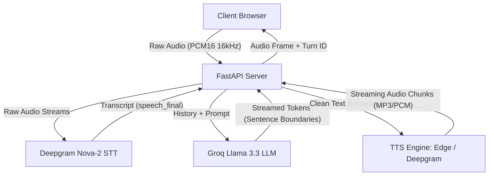
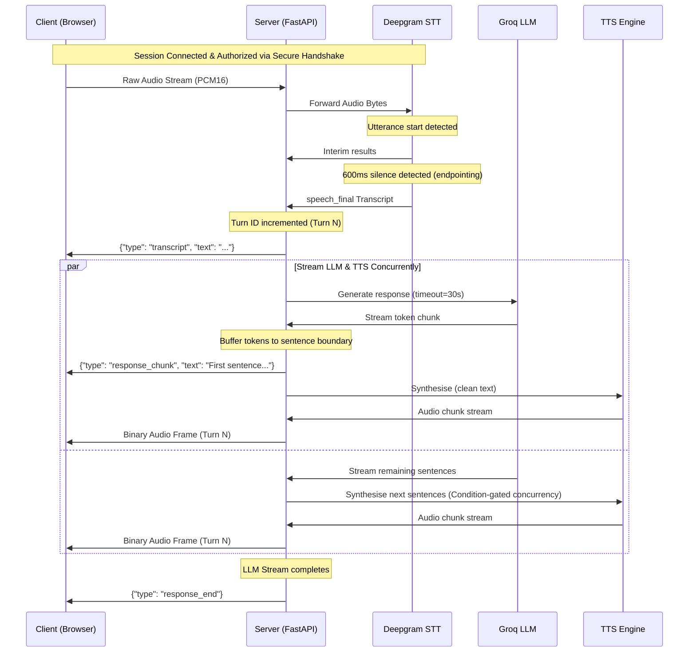

# Cascade AI Voice Tutor - Architecture Overview

Cascade is built on a full-duplex WebSocket-based streaming architecture to achieve sub-second voice tutoring interactions. This document outlines the key components, data flow, and timing instrumentation.

---

## System Architecture

---

## Turn Processing Pipeline

Cascade processes a single interaction (turn) using a concurrent, asynchronous generator-based pipeline:

---

## Interruption and Turn Gate Logic

To prevent stale audio or responses from previous turns reaching the user after they have interrupted the tutor (VAD barge-in), Cascade employs strict epoch boundary gates:

1. **Turn ID Validation:** Every outgoing frame or JSON packet is stamped with a `turn_id`. The client and final WebSocket consumer only send/play frames if the `turn_id == active_turn_id`.
2. **Newest-Wins Policy:** If a new transcript starts processing while a previous turn is active or playing back, the active turn is aborted synchronously (tasks cancelled, LLM generator closed via `.aclose()`), and the pipeline starts the new turn immediately.
3. **Condition-Gated TTS Concurrency:** Dynamic scheduling of TTS synthesis using `asyncio.Condition` limits network and CPU concurrency based on backlogs without resorting to CPU polling.
