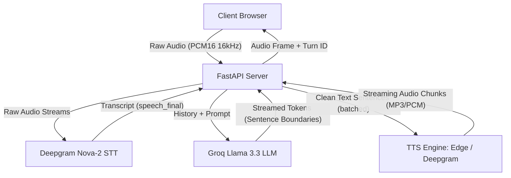
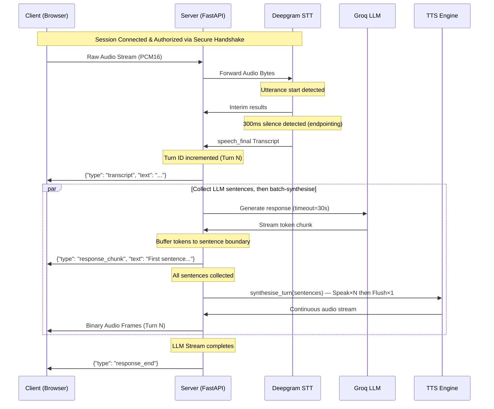
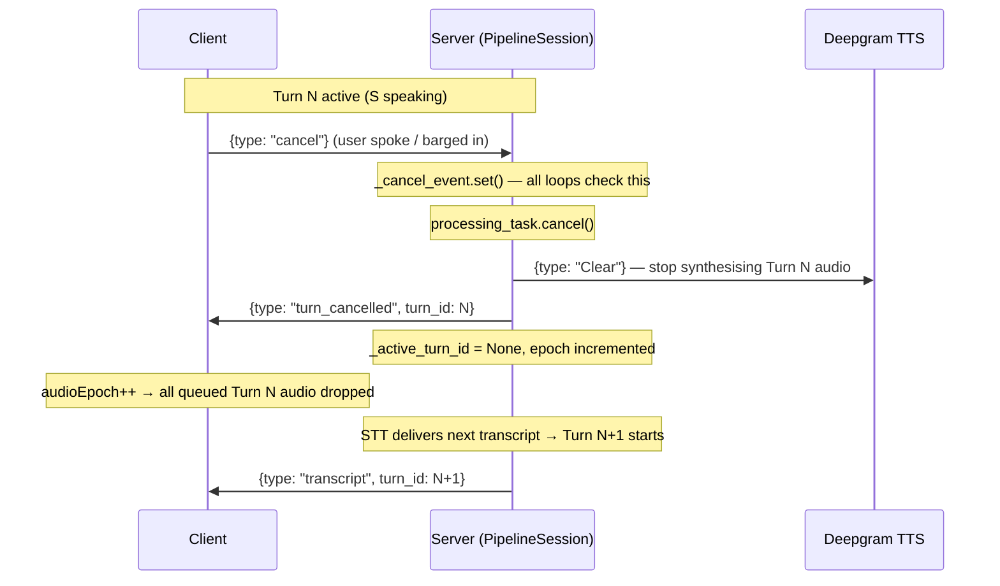

# Cascade AI Voice Tutor - Architecture Overview

Cascade is built on a full-duplex WebSocket-based streaming architecture to achieve sub-second voice tutoring interactions. This document outlines the key components, data flow, and timing instrumentation.

---

## System Architecture

---

## Turn Processing Pipeline

Cascade processes a single interaction (turn) using a concurrent, asynchronous generator-based pipeline:

---

## Interruption and Turn Gate Logic

To prevent stale audio or responses from previous turns reaching the user after they have interrupted the tutor (VAD barge-in), Cascade employs strict epoch boundary gates:

1. **Turn ID Validation:** Every outgoing frame or JSON packet is stamped with a `turn_id`. The client and final WebSocket consumer only send/play frames if the `turn_id == active_turn_id`.
2. **Newest-Wins Policy:** If a new transcript starts processing while a previous turn is active or playing back, the active turn is aborted synchronously (tasks cancelled, LLM generator closed via `.aclose()`), and the pipeline starts the new turn immediately.
3. **Semaphore-Gated TTS:** TTS concurrency is controlled by `asyncio.Semaphore(2)`, scoped per turn so a new turn always starts with fresh capacity (not competing with dying tasks from the interrupted turn).

---

## Interruption Flow

---

## Security Model

| Control | Mechanism |
|---|---|
| Origin validation | Hostname equality check via `urlsplit()` — not substring containment |
| Pre-auth audio buffer | 256KB cumulative cap + 10MB per-chunk cap during HMAC handshake window |
| HMAC authentication | Optional `CASCADE_AUTH_SECRET`; HMAC-SHA256 challenge-response |
| CORS | Configurable via `CASCADE_CORS_ORIGINS` env var (default `*` for local dev) |
| Concurrency cap | `CASCADE_MAX_CONCURRENT_SESSIONS` process-level semaphore |
| Per-session audio rate | Token-bucket: 32KB/s with 2s burst allowance |
