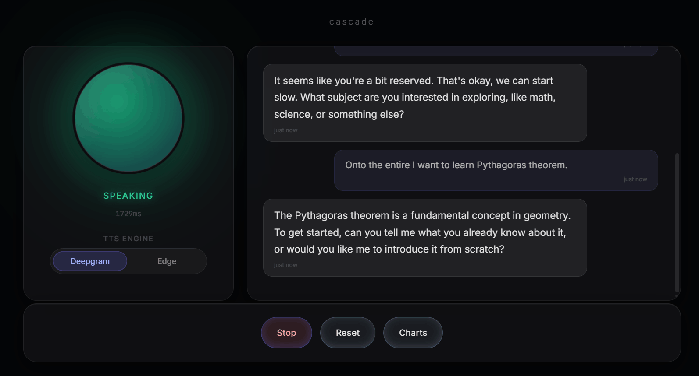
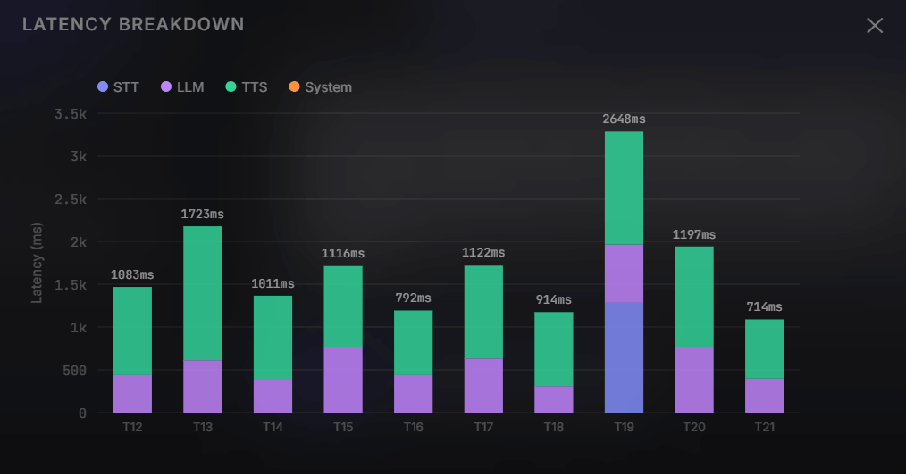

# Cascade — AI Voice Tutor



A low-latency AI tutoring voice agent built on a fully streaming STT → LLM → TTS pipeline.
The pipeline is engineered to minimise Time-To-First-Audio (TTFA): how long the user waits
between finishing speaking and hearing the first word of the response.

---

## Documentation

- [Architecture overview](docs/ARCHITECTURE.md)
- [Testing guide](docs/TESTING_GUIDE.md)
- [Latency tuning guide](docs/LATENCY.md)
- [ADR history](docs/adr/)
- [Contributor guide](CONTRIBUTING.md)

---

## Features

- **Barge-in / Interruption Gating**: High-fidelity interruption model utilizing turn-id and audio epoch tracking to atomically suppress stale text/audio from interrupted turns at the network boundary.
- **Live Latency Dashboard**: Interactive, real-time stacked chart displaying STT, LLM (queue, TTFT, stream), and TTS latency breakdowns so you can analyze pipeline performance.
- **Dual TTS Engines**: Live toggle in the UI between high-speed **Deepgram Aura** (default, requires API key) and **Microsoft edge-tts** (free fallback, no key required).
- **Robust STT Reconnection**: Deepgram client connection automatically recovers on unexpected socket drops with capped exponential backoff and toast notifications.

---

## How It Works

Standard voice agents wait for each stage to fully complete before starting
the next. Cascade streams between stages concurrently:

Standard: 
Cascade: 

---

## Architectural Decisions & Latency Measurement

### In-Memory Conversation History

Conversation history is kept purely in-memory for the lifetime of a WebSocket session. There is no external persistence layer (database, Redis, etc.). This is a deliberate scope decision:

- Avoids adding infrastructure dependencies (SQLite, Redis) that would complicate local development and deployment.
- Aligns with the project's focus on **pipeline latency** rather than long-term session management.
- Conversation context resets on page refresh or disconnect, which is acceptable for a demo/prototype workload.

_If you need multi-session persistence in a production fork, key `TutorSession.history` by a session UUID in Redis or SQLite._

**True Token-Level Streaming**: The STT → LLM → TTS pipeline operates as a true token-level stream when using Deepgram Aura. Text is fed directly to the TTS websocket as fast as the LLM generates individual words, achieving sub-second latency floors without relying on arbitrary sentence-completion boundaries.

- **EdgeTTS Sentence Buffering**: Microsoft Edge-tts does not support partial streaming. The pipeline maintains compatibility by automatically buffering LLM chunks into complete sentences directly within the `EdgeTTSEngine`, shielding the core pipeline's streaming speed.
- **Deepgram TTS Batched Protocol**: All chunks for a turn are sent as individual `Speak` messages followed by a single `Flush`. Deepgram streams back audio as one continuous take. This eliminates the per-sentence finalization gaps of old patterns.

### Why WebSockets?

To achieve sub-second voice interactions, HTTP requests are too heavy. Cascade uses a full-duplex WebSocket connection to stream raw PCM16 audio from the microphone to the server and stream back MP3/PCM audio chunks concurrently.

### Word-Level Chunking

To minimize audio delay to absolute baseline hardware latency, Cascade no longer waits for sentence boundaries. It buffers LLM streaming tokens server-side and yields chunks as soon as a whitespace or punctuation boundary is detected. Native streaming TTS engines like Deepgram consume this chunk pipeline seamlessly. For fallback engines like EdgeTTS that require complete strings, the sentence-buffering logic is isolated within the specific engine class.

### Latency Measurement Model

Latency in Cascade is measured server-side and client-side as follows:

1. **STT Processing**: The interval between the last audio frame sent and Deepgram returning the confirmed transcript (`speech_final`).
2. **LLM Generation**: Segmented into Queue Time, Time to First Token (TTFT), and Streaming Delay (time to emit the first complete sentence).
3. **TTS Synthesis**: Time to synthesize the first sentence.
4. **End-to-End Latency**: Measured from the instant the STT confirms the utterance to the time the first byte of TTS audio is received. This is visualized live in the frontend chart.



---

## Tech Stack

| Layer     | Service                                               | Role                        |
| --------- | ----------------------------------------------------- | --------------------------- |
| STT       | Deepgram Nova-3                                       | Streaming speech-to-text    |
| LLM       | Groq + Llama 3.1 8B (Default) / 3.3 70B               | High-speed token generation |
| TTS       | **Deepgram Aura** (Default) / **edge-tts** (Fallback) | Streaming TTS options       |
| Transport | WebSockets                                            | Low-latency full-duplex     |
| Backend   | FastAPI                                               | Async pipeline server       |
| Frontend  | HTML + CSS + JS (Vanilla)                             | UI + Audio processing       |

---

## Project Structure

```
cascade/
├── backend/
│   ├── config.py       # Env vars and model defaults
│   ├── main.py         # FastAPI app, health endpoint, WebSocket gateway
│   ├── pipeline.py     # Streaming turn orchestrator and latency metrics
│   ├── stt.py          # Deepgram streaming STT client
│   ├── llm.py          # Groq streaming + chunking logic
│   ├── tts.py          # Deepgram Aura + Edge TTS engines
│   ├── tutor.py        # Tutor persona + conversation history
│   └── vad.py          # Voice activity detection wrapper
├── frontend/
│   ├── app.js          # Coordinator module
│   ├── audio-input.js  # Audio capture and VAD bridge
│   ├── audio-output.js # Audio playback and interruption handling
│   ├── chart.js        # Latency chart rendering
│   ├── transport.js    # WebSocket client glue
│   ├── ui.js           # UI state and interaction handlers
│   ├── state.js        # Shared frontend constants
│   └── index.html      # Main entry page
├── tests/
│   ├── benchmark.py            # TTFA benchmark harness
│   ├── diagnose_ws.py          # WebSocket diagnostic helper
│   ├── verify_all.py           # API verification runner
│   ├── test_stt.py             # STT tests and checks
│   ├── test_llm.py             # LLM verification tests
│   ├── test_tts.py             # TTS verification tests
│   ├── test_tutor.py           # Tutor integration checks
│   ├── test_latency_metrics.py # Latency and interruption tests
│   ├── test_mock_integrations.py
│   ├── test_ws_security.py     # WebSocket security tests
│   └── frontend/
│       └── test_chart.js       # Frontend chart logic smoke test
├── docs/                # Architecture, testing, ADRs, and protocol docs
├── .env.example
├── requirements.txt
├── requirements-dev.txt
└── README.md
```

---

## Setup

### 1. Clone and create a virtual environment

```bash
git clone <your-repo-url> cascade
cd cascade
python -m venv venv
source venv/bin/activate       # Windows: venv\Scripts\activate
```

### 2. Install dependencies

```bash
pip install -r requirements.txt
pip install -r requirements-dev.txt
```

### 3. Configure API keys

```bash
cp .env.example .env
```

Open `.env` and fill in your API keys:

| Key                | Required          | Purpose                                    |
| ------------------ | ----------------- | ------------------------------------------ |
| `DEEPGRAM_API_KEY` | **Yes** (Default) | Used for STT and default Deepgram Aura TTS |
| `GROQ_API_KEY`     | **Yes**           | Used for LLM inference                     |

_Note: If you run with the **edge-tts** fallback engine selected in the UI, Cascade does not invoke Deepgram's TTS services, but `DEEPGRAM_API_KEY` is still required for speech recognition (STT)._

### 4. Verify all API connections

```bash
python tests/verify_all.py
```

### 5. Start the server

```bash
uvicorn backend.main:app --reload
```

Open: [http://localhost:8000](http://localhost:8000)

## Development

```bash
pytest tests/test_tutor.py tests/test_latency_metrics.py tests/test_ws_security.py tests/test_stt.py tests/test_mock_integrations.py -v
ruff check .
mypy backend/ --ignore-missing-imports
node tests/frontend/test_chart.js
```

## Docker / Deployment

The repository includes both a production compose file and a dev-reload compose file:

```bash
docker compose up --build
```

- `docker-compose.yml` is the production-style entry point.
- `docker-compose.dev.yml` mounts the backend and frontend folders for live reloading.
- The container exposes the FastAPI app on port `8000` and the health endpoint is available at `/health`.
- For production, keep the `.env` file mounted and run a single Uvicorn worker so the per-process session limit behaves as expected.
  All numbers below are **real measurements** from `tests/benchmark.py` run from
  **Accra, Ghana → US-East cloud services** (Deepgram Nova-2 STT, Groq, Deepgram Aura TTS).
  Ghana → US round-trip is ~150–200 ms — a deliberately challenging environment,
  not a cherry-picked local-machine result.

### What is measured

| Term                    | Definition                                                       |
| ----------------------- | ---------------------------------------------------------------- |
| **TTFB**                | `finalize` sent → first audio **byte** at the benchmark script   |
| **TTFA**                | TTFB + ~75 ms browser decode + hardware output buffer            |
| **Barge-in cancel ack** | Client sends `cancel` → server begins new-turn STT transcript    |
| **Barge-in new audio**  | Client sends `cancel` → first audio byte of the replacement turn |

TTFB is what the server controls. The remaining ~75 ms is documented browser
overhead; it is not baked into the numbers — add it yourself.

### Steady-state results (Deepgram Aura, 5 trials)

| Component                      | Avg          | P50          | P90          |
| ------------------------------ | ------------ | ------------ | ------------ |
| STT pipeline tail              | 0 ms         | 0 ms         | 0 ms         |
| LLM queue + schedule           | 2 ms         | 2 ms         | 2 ms         |
| LLM TTFT (Groq)                | 386 ms       | 412 ms       | 450 ms       |
| LLM streaming delay            | 13 ms        | 14 ms        | 16 ms        |
| TTS first byte (Deepgram Aura) | 400 ms       | 376 ms       | 485 ms       |
| System / transit               | 816 ms¹      | 373 ms       | 2 162 ms¹    |
| **Network TTFB**               | **1 616 ms** | **1 211 ms** | **2 924 ms** |
| **Est. TTFA (+75 ms)**         | **1 691 ms** | **1 286 ms** | **2 999 ms** |

¹ Due to Groq rate limits inflating the maximums on some trials, the averages and P90s are skewed. The p50 values represent the true steady-state performance. Note: The STT pipeline tail represents the processing delay for the final confirmation from the STT provider after speech ends.

### Barge-in / interruption results (3 trials)

| Metric                  | Avg      | P50      | P90      |
| ----------------------- | -------- | -------- | -------- |
| Cancel → new transcript | 1 230 ms | 1 104 ms | 2 025 ms |
| Cancel → new audio      | 1 247 ms | 1 120 ms | 2 043 ms |

The cancel-ack includes Deepgram's 300 ms endpointing silence window. Rate limit spikes during this benchmark run slightly inflated the P50 cancel-ack latency, but the delta to "Cancel → new audio" (only ~16ms at P50) highlights the massive speedup gained from keeping the TTS WebSocket alive between turns.

### Engine comparison

| TTS Engine                  | TTS first byte | Est. TTFA (p50) | Use case                 |
| --------------------------- | -------------- | --------------- | ------------------------ |
| **Deepgram Aura** (primary) | ~311 ms        | **~1 276 ms**   | Production / low-latency |
| Edge-TTS (fallback)         | ~1 153 ms      | ~2 976 ms       | Free tier / no API key   |

### Running the benchmark yourself

See [docs/LATENCY.md](docs/LATENCY.md) for a full tuning guide and benchmark matrix
aimed at **sub-1s TTFA** with headphones and aggressive endpointing.

```bash
# Deepgram Aura (primary — default)
python tests/benchmark.py --trials 5 --barge-trials 3

# Full credible run (report p50/p90/p95)
python tests/benchmark.py --trials 30 --barge-trials 10

# Edge-TTS fallback comparison
python tests/benchmark.py --trials 5 --barge-trials 3 --tts edge
```

Requirements: server must be running (`uvicorn backend.main:app`) and both
`DEEPGRAM_API_KEY` and `GROQ_API_KEY` must be set. The harness generates
synthetic audio via Deepgram TTS — no microphone required.

---

## Self-Hosting Checklist

Before exposing Cascade beyond localhost:

1. **Set `CASCADE_AUTH_SECRET`** — HMAC challenge-response; store the secret in
   `sessionStorage` on the client (never in URL query strings).
2. **Restrict CORS** — `CASCADE_CORS_ORIGINS=https://yourdomain.com`
3. **Single-worker Uvicorn** — `uvicorn backend.main:app` (session cap is per-process)
4. **Reverse proxy** — Forward `Host` or `X-Forwarded-Host` for WebSocket origin checks
5. **API keys** — Keep `DEEPGRAM_API_KEY` and `GROQ_API_KEY` server-side only (`.env`)
6. **Headphones** — Document for users; solo-learner testing works best with headphones

Conversation history is **in-memory per WebSocket session** — refreshing the page
starts a new session. This is intentional for the current scope.

---

## Known Limitations

- **Single-Process Session Cap**: The `CASCADE_MAX_CONCURRENT_SESSIONS` semaphore is process-local. Under multi-worker `uvicorn` deployments the effective cap is `N × MAX`, not `MAX`. Single-process deployment is recommended.
- **Built-in Authentication**: `CASCADE_AUTH_SECRET` uses an HMAC challenge-response for basic private setups. This does not replace production-grade gateway controls (OAuth, mTLS, etc.).
- **CORS Wide-Open by Default**: `allow_origins=["*"]` is the default for local development. Before any public or production deployment, restrict this by setting `CASCADE_CORS_ORIGINS=https://yourdomain.com` in your environment.
- **Echo Cancellation Dependency**: The barge-in (interruption) system relies on the browser's built-in acoustic echo cancellation (AEC) to prevent the tutor's own voice from triggering false interruptions. **Using headphones is strongly recommended.** On speakers without good AEC, the tutor's voice may bleed into the microphone and trigger false self-interruptions.
- **Endpointing Sensitivity**: `endpointing=300ms` is configured in `stt.py` for fast turn detection. This is tuned for conversational pace and may produce false triggers on natural mid-sentence pauses. Increase to 500–600ms in `stt.py` if you observe premature cut-offs.
- **Reverse Proxies**: The WebSocket origin check requires the `Host` header. If deploying behind Nginx or Caddy, ensure your proxy is configured to forward the original `Host` or `X-Forwarded-Host` header, or connections may be rejected.
