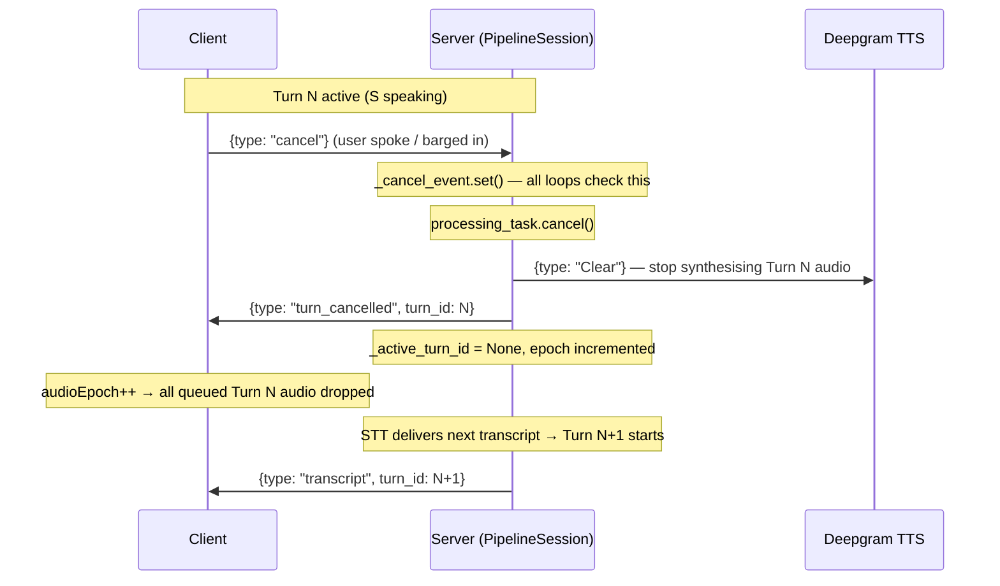
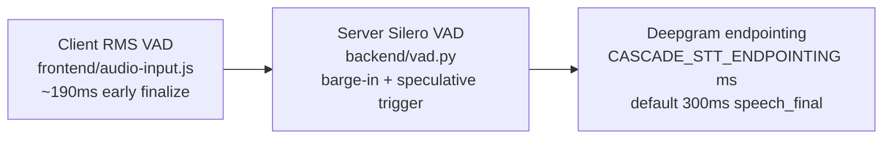

# Cascade AI Voice Tutor - Architecture Overview

Cascade is built on a full-duplex WebSocket-based streaming architecture to achieve low-latency voice tutoring interactions. The primary configuration uses **Deepgram Aura** for TTS and the defaults in [backend/config.py](../backend/config.py) for STT and LLM selection. This document outlines the key components, data flow, timing instrumentation, and the operational contracts for the live system.

---

## System Architecture


---

## Turn Processing Pipeline

Cascade processes a single interaction (turn) using a concurrent, asynchronous generator-based pipeline:


**Diagram Notes:**

- Dashed lifelines represent each participant; solid arrows are blocking requests, dashed arrows are streams/fire-and-forget
- The outer dashed rectangle is the concurrent (par) block — key distinction from a sequential pipeline
- The `↻ repeats until LLM stream ends` line inside the par block communicates the core streaming loop

---

## Interruption and Turn Gate Logic

To prevent stale audio or responses from previous turns reaching the user after they have interrupted the tutor (VAD barge-in), Cascade employs strict epoch boundary gates:

1. **Turn ID Validation:** Every outgoing frame or JSON packet is stamped with a `turn_id`. The client and final WebSocket consumer only send/play frames if the `turn_id == active_turn_id`.
2. **Newest-Wins Policy:** If a new transcript starts processing while a previous turn is active or playing back, the active turn is aborted synchronously (tasks cancelled, LLM generator closed via `.aclose()`), and the pipeline starts the new turn immediately.
3. **Lock-Serialized TTS:** TTS access is controlled by `asyncio.Lock` (`DeepgramTTSEngine._ws_lock`), serializing turns on a single persistent WebSocket connection — fully serial by design, not 2-wide. Cleanup (Clear + WS teardown on failure) is performed _outside_ the lock so a new turn can acquire it and start immediately while the previous turn's teardown completes in the background.

---

## Interruption Flow



---

## WebSocket Protocol

See [WEBSOCKET_PROTOCOL.md](WEBSOCKET_PROTOCOL.md) for the full message catalog
(client ↔ server types, fields, and turn-gating rules).

---

## Three-Layer VAD Stack

End-of-utterance detection and barge-in span three cooperating layers:



### Client RMS VAD (`frontend/audio-input.js`)

The browser applies a lightweight RMS-based voice-activity layer before audio
reaches the server:

- **Early finalize:** After 130 ms of local silence (`localFinalizeSilenceMs`)
  plus a 60 ms debounce timer, the client sends `{type: "finalize"}` — often
  beating Deepgram's 300 ms endpointing window.
- **Interruption detection:** During AI playback, RMS thresholds
  (`rmsInterruptionSpeakingMultiplier`, `rmsInterruptionProcessingMultiplier`)
  detect user speech and trigger client-side `cancel`.
- **Felt-latency anchor:** When silence is detected, `_speechEndMs` is stamped
  for the latency dashboard (perceived latency measurement).

Server-side Silero VAD handles barge-in cancellation when the user resumes
speaking during AI playback, and optionally triggers speculative LLM starts.
Deepgram's cloud endpointing remains the authoritative source for `speech_final`.

See [LATENCY.md](LATENCY.md) for tuning knobs affecting each layer.

---

## Deployment

### Docker Compose

The repository includes two compose entry points:

- `docker-compose.yml` — production-style deployment.
- `docker-compose.dev.yml` — development workflow with bind mounts for live reload.

### Start the stack

```bash
docker compose up --build
```

The app is served on port `8000` and the health endpoint is available at `/health`.

The Docker image pre-downloads the Silero VAD model at build time (`TORCH_HOME=/app/.cache/torch`), so cold starts do not depend on GitHub reachability at runtime.

### Environment requirements

- Copy `.env.example` to `.env` and fill in your API keys.
- Keep the `.env` file mounted into the container so the runtime can read the same values as local development.
- For production deployments, prefer a single Uvicorn worker because the concurrent-session cap is process-local.

### Production notes

- Set `CASCADE_AUTH_SECRET` if you want the WebSocket gateway to require an auth handshake.
- Restrict `CASCADE_CORS_ORIGINS` instead of leaving it as `*` for public deployments.
- Use a reverse proxy in front of the container if you need TLS termination or additional gateway controls.

---

## Security Model

| Control                | Mechanism                                                                   |
| ---------------------- | --------------------------------------------------------------------------- |
| Origin validation      | Hostname equality check via `urlsplit()` — not substring containment; `localhost`/`127.0.0.1` origins are only accepted when the server host is also local |
| Pre-auth audio buffer  | 256KB cumulative cap + 10MB per-chunk cap during HMAC handshake window      |
| HMAC authentication    | Optional `CASCADE_AUTH_SECRET`; HMAC-SHA256 challenge-response              |
| CORS                   | Configurable via `CASCADE_CORS_ORIGINS` env var (default `*` for local dev) |
| Concurrency cap        | `CASCADE_MAX_CONCURRENT_SESSIONS` process-level semaphore                   |
| Per-session audio rate | Token-bucket: 32KB/s with 5s burst allowance                                |
